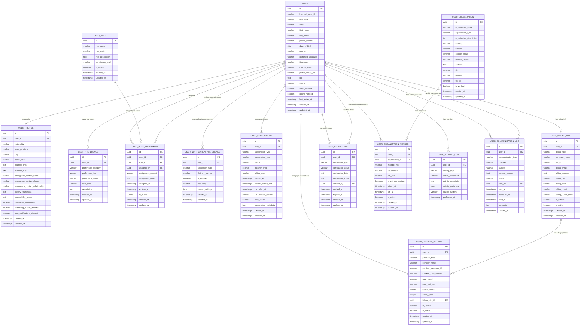

```mermaid
erDiagram
    USER {
        uuid id PK
        varchar keycloak_user_id
        varchar username
        varchar email
        varchar first_name
        varchar last_name
        varchar phone_number
        date date_of_birth
        varchar gender
        varchar preferred_language
        varchar timezone
        varchar country_code
        varchar profile_image_url
        text bio
        varchar status
        boolean email_verified
        boolean phone_verified
        timestamp last_active_at
        timestamp created_at
        timestamp updated_at
    }
    
    USER_PROFILE {
        uuid id PK
        uuid user_id FK
        varchar nationality
        varchar state_province
        varchar city
        varchar postal_code
        text address_line1
        text address_line2
        varchar emergency_contact_name
        varchar emergency_contact_phone
        varchar emergency_contact_relationship
        text dietary_restrictions
        text accessibility_needs
        boolean newsletter_subscribed
        boolean marketing_emails_allowed
        boolean sms_notifications_allowed
        timestamp created_at
        timestamp updated_at
    }
    
    USER_PREFERENCE {
        uuid id PK
        uuid user_id FK
        varchar preference_category
        varchar preference_key
        varchar preference_value
        varchar data_type
        text description
        timestamp created_at
        timestamp updated_at
    }
    
    USER_ROLE {
        uuid id PK
        varchar role_name
        varchar role_code
        text role_description
        varchar permission_level
        boolean is_active
        timestamp created_at
        timestamp updated_at
    }
    
    USER_ROLE_ASSIGNMENT {
        uuid id PK
        uuid user_id FK
        uuid role_id FK
        uuid assigned_by FK
        varchar assignment_context
        text assignment_notes
        timestamp assigned_at
        timestamp expires_at
        boolean is_active
        timestamp created_at
        timestamp updated_at
    }
    
    USER_NOTIFICATION_PREFERENCE {
        uuid id PK
        uuid user_id FK
        varchar notification_type
        varchar delivery_method
        boolean is_enabled
        varchar frequency
        json custom_settings
        timestamp created_at
        timestamp updated_at
    }
    
    USER_SUBSCRIPTION {
        uuid id PK
        uuid user_id FK
        varchar subscription_type
        varchar subscription_plan
        varchar status
        decimal monthly_price
        varchar billing_cycle
        timestamp started_at
        timestamp current_period_end
        timestamp cancelled_at
        varchar cancellation_reason
        boolean auto_renew
        json subscription_metadata
        timestamp created_at
        timestamp updated_at
    }
    
    USER_BILLING_INFO {
        uuid id PK
        uuid user_id FK
        varchar billing_type
        varchar company_name
        varchar tax_id
        varchar billing_email
        text billing_address
        varchar billing_city
        varchar billing_state
        varchar billing_country
        varchar billing_postal_code
        boolean is_default
        boolean is_active
        timestamp created_at
        timestamp updated_at
    }
    
    USER_PAYMENT_METHOD {
        uuid id PK
        uuid user_id FK
        varchar payment_type
        varchar provider_name
        varchar provider_customer_id
        varchar masked_card_number
        varchar card_brand
        varchar card_last_four
        integer expiry_month
        integer expiry_year
        uuid billing_info_id FK
        boolean is_default
        boolean is_active
        timestamp created_at
        timestamp updated_at
    }
    

    
    USER_VERIFICATION {
        uuid id PK
        uuid user_id FK
        varchar verification_type
        varchar verification_status
        text verification_data
        text verification_notes
        uuid verified_by FK
        timestamp verified_at
        timestamp expires_at
        timestamp created_at
        timestamp updated_at
    }
    
    USER_ORGANIZATION {
        uuid id PK
        varchar organization_name
        varchar organization_type
        text organization_description
        varchar industry
        varchar website
        varchar contact_email
        varchar contact_phone
        text address
        varchar city
        varchar country
        varchar tax_id
        boolean is_verified
        timestamp created_at
        timestamp updated_at
    }
    
    USER_ORGANIZATION_MEMBER {
        uuid id PK
        uuid user_id FK
        uuid organization_id FK
        varchar member_role
        varchar department
        varchar job_title
        boolean is_primary_contact
        timestamp joined_at
        timestamp left_at
        boolean is_active
        timestamp created_at
        timestamp updated_at
    }
    
    USER_ACTIVITY_LOG {
        uuid id PK
        uuid user_id FK
        varchar activity_type
        varchar action_performed
        text activity_description
        json activity_metadata
        varchar source_system
        timestamp performed_at
    }
    
    USER_COMMUNICATION_LOG {
        uuid id PK
        uuid user_id FK
        varchar communication_type
        varchar channel
        varchar subject
        text content_summary
        varchar status
        uuid sent_by FK
        timestamp sent_at
        timestamp delivered_at
        timestamp read_at
        json metadata
        timestamp created_at
    }

    %% Core User Relationships
    USER ||--|| USER_PROFILE : "has profile"
    USER ||--o{ USER_PREFERENCE : "has preferences"
    USER ||--o{ USER_ROLE_ASSIGNMENT : "has roles"
    USER ||--o{ USER_NOTIFICATION_PREFERENCE : "has notification preferences"
    USER ||--o{ USER_SUBSCRIPTION : "has subscriptions"
    USER ||--o{ USER_BILLING_INFO : "has billing info"
    USER ||--o{ USER_PAYMENT_METHOD : "has payment methods"
    USER ||--o{ USER_VERIFICATION : "has verifications"
    USER ||--o{ USER_ORGANIZATION_MEMBER : "member of organizations"
    USER ||--o{ USER_ACTIVITY_LOG : "has activities"
    USER ||--o{ USER_COMMUNICATION_LOG : "has communications"
    
    %% Role Relationships
    USER_ROLE ||--o{ USER_ROLE_ASSIGNMENT : "assigned to users"
    
    %% Payment Relationships
    USER_BILLING_INFO ||--o{ USER_PAYMENT_METHOD : "used for payments"
    
    %% Organization Relationships
    USER_ORGANIZATION ||--o{ USER_ORGANIZATION_MEMBER : "has members"
    
    %% Self-referencing for assignments and verifications
    USER ||--o{ USER_ROLE_ASSIGNMENT : "assigns roles to others"
    USER ||--o{ USER_VERIFICATION : "verifies others"
    USER ||--o{ USER_COMMUNICATION_LOG : "sends communications"
```